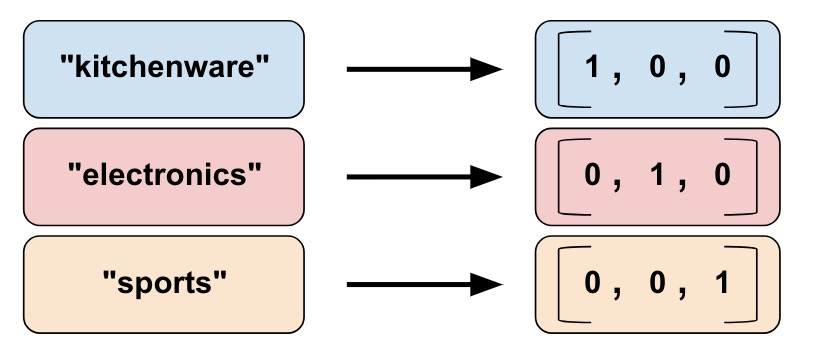

# BOW Representations
__Anish Sachdeva (DTU/2K16/MC/13)__

__Natural Language Processing - Dr. Seba Susan__

[📕 One Hot Vector](notebooks/one-hot-vector.ipynb) | 
[📕 Term Frequency (TF)](notebooks/term-frequency.ipynb) | 
[📕 Term Frequency - Inverse Document Frequency (TF-IDF)](notebooks/term-frequency-inverse-document-frequency.ipynb) | 
[✒ Report](assets)



## 📖 Overview
1. [Introduction](#introduction)
1. [Implementation](#implementation)
1. [Results](#results)
1. [Analytics & Discussions](#analytics--discussion)
1. [Running it on Your Machine](#running-it-on-your-machine)
1. [Bibliography](#bibliography)

## Introduction

## Implementation

## Results
1. ⭐ [One Hot Vector](assets/one-hot-vector.txt)
1. ⭐ [Term Frequency (TF) Vectors](assets/tf.txt)
1. ⭐ [Term Frequency Inverse Document Frequency (TF-IDF) vectors](assets)

## Running it on Your Machine
Clone this project on your machine and enter the src directory
```bash
git clone https://github.com/anishLearnsToCode/bow-representation.git
cd bow-representation/src
```

See Vector Outputs as 
```bash
python one-hot-vector.py
python tf.py
python tfidf.py
```

## Bibliography
1. [Speech & Language Processing ~Jurafsky](https://web.stanford.edu/~jurafsky/slp3/)
1. [nltk](https://www.nltk.org/)
1. [pickle](https://docs.python.org/3/library/pickle.html)
1. [Porter Stemmer Algorithm](http://tartarus.org/martin/PorterStemmer)
1. [Porter Stemmer Implementation ~anishLearnsToCode](https://github.com/anishLearnsToCode/porter-stemmer)
1. [NLTK WordNetInterface](https://www.nltk.org/howto/wordnet.html)
1. [NLTK Stem Submodule](http://www.nltk.org/api/nltk.stem.html)
